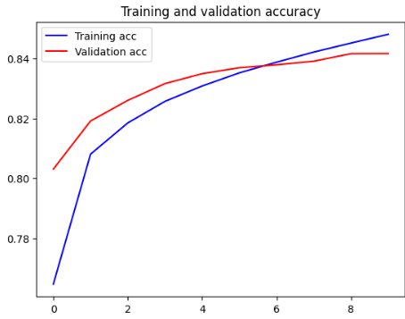
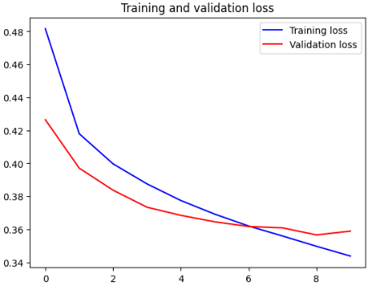
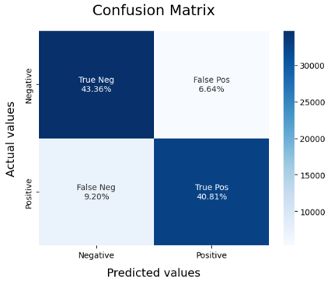
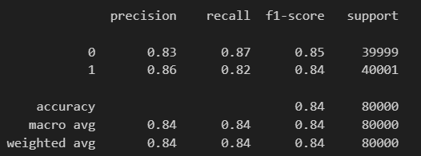

# Severity-of-Toxic-Comments

## Introduction
Deployed a Dockerized web app for multi-class classification of toxic comments with 83.5% accuracy, utilizing LSTM algorithm and FastText word embedding. Preprocessed 1.5M rows dataset to high standards using Pandas. Integrated with API and Streamlit frontend.

## Features
- Multi-class classification of toxic comments into various categories.
- Utilizes LSTM algorithm and FastText word embeddings for text classification.
- Preprocessed dataset of 1.6 million comments to ensure high-quality training and testing.
- Dockerized deployment for easy setup and scalability.
- Integrated API for backend processing and Streamlit frontend for a user-friendly interface.
- Achieves an accuracy of 83.5% on the classification task.

## Steps to Run
1. Clone the GitHub repository.
2. Create a new environment (.venv).
3. Install requirements.txt.
4. No need to run 'Data_Pre_Processing.ipynb' as the processed dataset 'final_dataframe.csv' is provided.
5. Run 'Training_the_Model.ipynb' to save the model and tokenizer.pickle file.
6. In the terminal, run the command 'streamlit run app.py' to start the web app.

## Dataset and Pre-Processing
The Sentiment140 dataset with 1.6 million tweets was used for model development and was customly preprocessed to high standards.

[Click here to get the dataset](https://www.kaggle.com/datasets/kazanova/sentiment140).

### Pre-processing steps
- Renamed column headers as they were not present in the dataset.
- Removed ~5k null values.
- Cleaned spelling errors and unexpected characters.
- Performed Lemmatization.
- Removed stopwords and biased words.
- Tokenized and padded the dataset.
- Converted words into vectors using FastText word embedding (also implemented GloVe and BERT).
- Split the dataset into Train set and Test set in a 95:5 ratio.

## Model Building
[Link to Word Vectorizer File](https://www.kaggle.com/datasets/lmnguyntrn/wiki-news-300d-1m)

- Worked with FastText, GloVe, and BERT embeddings (BERT was limited due to resources).
- Experimented with LSTM and LSTM-CNN hybrid models, with LSTM showing better results.
- Achieved 83.98% accuracy on the Train set and 83.51% on the Test set.
- Saved the model and tokenizer.

## Deployment

### Using Docker

1. Install Docker Hub for Desktop from their [official website](https://www.docker.com/products/docker-desktop).

2. Run the following two commands in your terminal or command prompt:

   ```bash
   docker build -t <image_name> .
   docker run -p 8501:8501 <image_name>

### Deployment on AWS (Coming Soon)

We will be adding further steps for deploying your application on AWS soon.

## Dataset and Pre-Processing
- Accuracy graph



- Loss Graph



- Confusion Matric



- F1 score, Precision, and Recall




